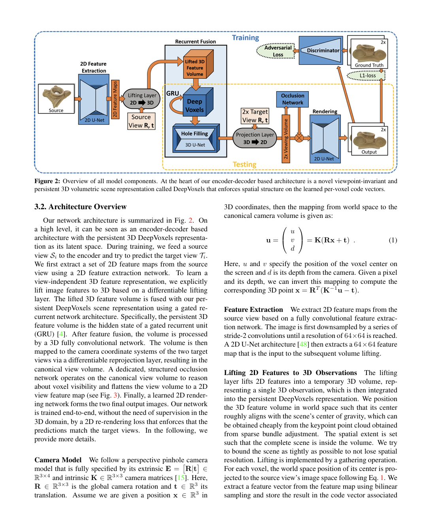
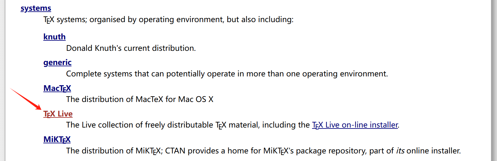
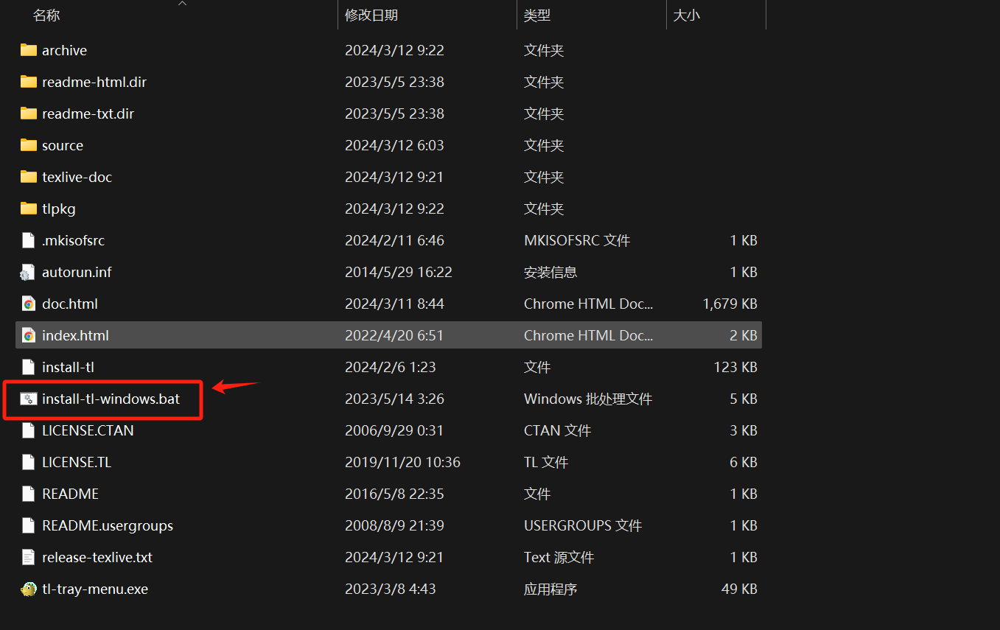
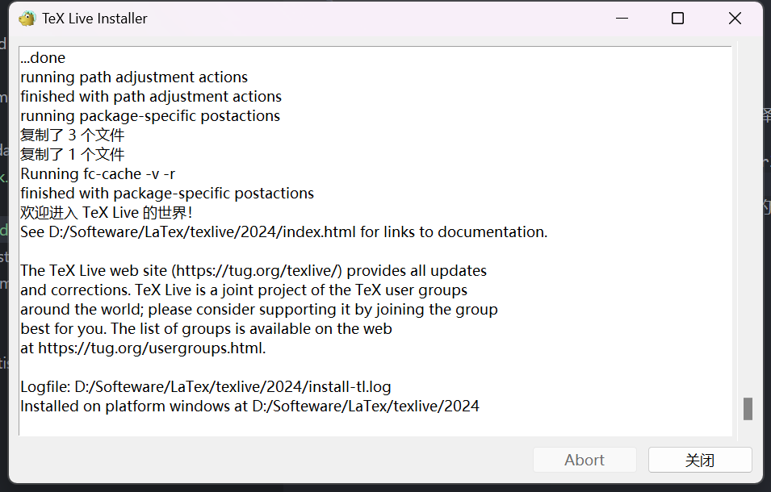
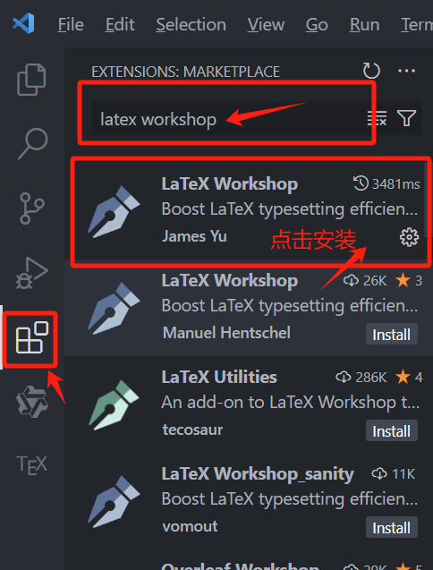

---
hide:
  - navigation
comments: true
---

# LaTex 学习笔记

!!! warning "本文环境配置部分已完稿，深入学习部分尚未完稿，想深入学习可以参考[补充资料](#appendix)"

> Typography exists to honor content. —R. Bringhurst  
> 内容永远比格式重要！——罗伯特·布林赫斯特

## LaTex 介绍

{ width="320" align=right}
LaTeX（发音为“Lay-tek”或“Lah-tek”）是一种基于 TeX 的排版系统，广泛应用于学术界、科研领域的论文期刊以及各种学术文档的排版，此外还有人将其用于排版简历。它允许用户通过编写纯文本文件，使用特定的命令和标记来描述文档的结构和格式，而不是直接控制排版。LaTeX 特别适合处理数学公式、引用、图表、算法等复杂内容，因此在需要精密排版的领域，如科学、技术、工程和数学（STEM）领域得到了广泛应用。

LaTex 和我们通常使用的 word 是有不小区别的，Word 的界面就是一张 A4 纸，输入的时候是什么样子，最后呈现出来就是什么样子。这给了我们极高的自由度，也非常容易上手，但是有如下问题：

- 对于对细节不敏感的用户，Word 的排版常常会在细节存在问题，比如两段话之间行间距不同、字体不同、标题样式不同等；
- 对于撰写论文的用户，Word 的标题、章节、图表、参考文献等无法自动标号，也很难在正文中引用；
- 对于有公式输入需求的用户，Word 自带的公式不稳定，而公式插件效果常常不好。  
  相比之下，使用 LaTeX 进行排版，就像是在铺好的轨道上驾驶火车一样。使用 LaTeX 没有办法像 Word 一样非常自由，但是可以保证规范性，这使得 LaTeX 非常适合用于论文的排版。

但是我还是想说 LaTex 和 word 都只是用来表达内容的工具，两者并无优劣之分，重要的是正确鲜明地表达出自己想要表达的内容，此外还需要遵循你所在的业界规范或是学校要求。

## LaTex 环境配置

??? question "不想配置环境？"

    可以选择 LaTex 的在线编辑器，国际版可以选择Overleaf，但由于该服务器在国外，在线编辑访问速度可能会有点慢。https://www.overleaf.com/

    国内版的可以选择 TeXPage，这个会相较于Overleaf速度快一些，但是由于软件还不成熟，部分功能可能会有缺失。https://www.texpage.com/

    在线编辑的LaTex编辑器如果需要使用一些进阶的功能都是要收费的，所以我更推荐大家使用本地部署的版本，改软件完全开源，在本地部署所有功能均可免费使用。

### 选择发行版

**常用发行版**：TEX Live、MacTEX、MiKTEX 等  
我们这里选择由官网维护的 TEX Live 发行版，如果是 MacOS 的可以选择 MacTEX，其相当于 mac 下的 TEX Live。

### 下载镜像并安装

- 我们在国内的[清华大学开源软件镜像站](https://mirrors.tuna.tsinghua.edu.cn/)中选择国内 CTAN 镜像；  
  { width="640" }
- 选择 TEX Live ;  
  { width="640" }
- 按以下步骤进行点击；  
  { width="320" }  
  { width="320" }
- 下载完成后，双击 iso 镜像文件，找到 `install-tl-windows.bat` 文件，并右键以管理员身份运行；  
  { width="640" }
- 进入安装界面，可以修改安装位置以及默认自带的语言，这里注意要取消勾选安装 TeXworks 前端，这个自带的 GUI 编辑界面不好用，我们后面会配置 vscode 来进行编辑 LaTex 文档；  
  { width="640" }
- 语言选择我们需要的即可；  
  { width="640" }
- 随后选择安装即可，安装可能需要较长时间，等待以下内容出现，即为安装完成；  
  { width="640" }
- 安装完成后，打开 cmd 命令行，输入 `xelatex -v` 命令，如果出现版本号，即为安装成功；  
  { width="640" }

### 配置 vscode

- 打开 vscode 拓展;
- 搜索 latex workshop，选择如下的插件点击 install;  
  { width="260" }
- 打开 vscode 环境设置;  
  { width="640" }
- 如果之前没有配置过 vscode 环境，json 这里应该只有一个大括号，直接将以下代码粘贴进大括号内，保存即可;
  { width="640" }

```json title="vscode 环境设置"
{
  "editor.wordWrap": "on",

  "latex-workshop.latex.autoBuild.run": "onSave",
  "latex-workshop.showContextMenu": true,
  "latex-workshop.intellisense.package.enabled": true,
  "latex-workshop.message.error.show": false,
  "latex-workshop.message.warning.show": false,
  "latex-workshop.latex.tools": [
    {
      "name": "xelatex",
      "command": "xelatex",
      "args": [
        "-synctex=1",
        "-interaction=nonstopmode",
        "-file-line-error",
        "%DOC%"
      ]
    },
    {
      "name": "pdflatex",
      "command": "pdflatex",
      "args": [
        "-synctex=1",
        "-interaction=nonstopmode",
        "-file-line-error",
        "%DOCFILE%"
      ]
    },
    {
      "name": "latexmk",
      "command": "latexmk",
      "args": [
        "-synctex=1",
        "-interaction=nonstopmode",
        "-file-line-error",
        "-pdf",
        "-outdir=%OUTDIR%",
        "%DOCFILE%"
      ]
    },
    {
      "name": "bibtex",
      "command": "bibtex",
      "args": ["%DOCFILE%"]
    }
  ],
  "latex-workshop.latex.recipes": [
    {
      "name": "XeLaTeX",
      "tools": ["xelatex"]
    },
    {
      "name": "PDFLaTeX",
      "tools": ["pdflatex"]
    },
    {
      "name": "BibTeX",
      "tools": ["bibtex"]
    },
    {
      "name": "LaTeXmk",
      "tools": ["latexmk"]
    },
    {
      "name": "xelatex -> bibtex -> xelatex*2",
      "tools": ["xelatex", "bibtex", "xelatex", "xelatex"]
    },
    {
      "name": "pdflatex -> bibtex -> pdflatex*2",
      "tools": ["pdflatex", "bibtex", "pdflatex", "pdflatex"]
    }
  ],
  "latex-workshop.latex.clean.fileTypes": [
    "*.aux",
    "*.bbl",
    "*.blg",
    "*.idx",
    "*.ind",
    "*.lof",
    "*.lot",
    "*.out",
    "*.toc",
    "*.acn",
    "*.acr",
    "*.alg",
    "*.glg",
    "*.glo",
    "*.gls",
    "*.ist",
    "*.fls",
    "*.log",
    "*.fdb_latexmk"
  ],
  "latex-workshop.latex.autoClean.run": "onFailed",
  "latex-workshop.latex.recipe.default": "XeLaTeX",
  "latex-workshop.view.pdf.viewer": "tab",
  "latex-workshop.synctex.afterBuild.enabled": true,
  "latex-workshop.view.pdf.internal.synctex.keybinding": "ctrl-click"
}
```

## 快速编写 LaTeX 文档

!!! warning "注意"

    编码定理:
    一般地，在任何场合使用（不带 BOM 的）UTF-8 编码均是最优
    选择．

- 配置完成后可以尝试新建后缀为 `.tex` 文件，并尝试将[以下内容](#file-structure)输入，并键入 ctrl+s 保存，由于配置文件中设置了保存时自动编译，保存后即可在当前文件夹下查看到 .pdf 文件;  
  { width="640" }
- 此外还可以在左边的拓展栏中选择 TeX ,并点击进行 pdf 编译;
  { width="640" }

## LaTeX 深入学习

### 引擎与格式

#### TeX 引擎与格式

TeX 引擎负责实际的排版处理，它根据文档的输入（通常是 .tex 文件），生成排版结果（通常为 .dvi、.pdf 或 .ps 文件）。TeX 处理的是纯文本，所有的排版效果都通过控制符号和命令来实现。例如，控制字体样式、行间距、页边距、数学公式等。

#### 常用 TeX 引擎

- 英文文章：pdfLaTEX、XELaTEX 或 LuaLaTEX;
- 中文文章：XELaTEX 或 LuaLaTEX;

### LaTeX 语法

#### 语法

- 注释以`%`开头，忽略其后所有内容
- 命令以`\`开头，区分大小写:  
  `\foo{arg}`：必选参数放在`{...}`中  
  `\foo[bar]{arg}`：可选参数放在`[...]`
- 环境以`\begin{...}`和`\end{...}`括起来
- 特殊符号需要转义：  
  \%、\$、\&、\textbackslash 等

#### 谋篇布局

**文档部件**:

- 标题：\title、\author、\date → \maketitle
- 摘要：abstract 环境
- 目录：\tableofcontents
- 章节：\chapter、\section、\subsection 等
- 文献：\bibliography

**文档划分**:

- 前中后：\frontmatter、\mainmatter、\backmatter
- 分文件编译：\include、\input

**文本标记**:

- 加粗：{\bfseries ...} 或\textbf{...}
- 倾斜：{\itshape ...} 或\textit{...}
- 字号：\tiny、\small、\large、\Large 等
- 换行：`\\`
- 缩进：\indent
- 居中：\centering 或 center 环境

#### 文件结构 {#file-structure}

```latex title="示例结构"
% 用 UTF-8 编码，命名为 xxx.tex
\documentclass{article}                     % 指明文档类型：文章
% 导言区：设置文档样式
\usepackage{amsmath}                        % 调用宏包，实现各种功能
\newcommand{\keyword}[1]{\textbf{#1}}       % 自定义命令

\begin{document}
% 正文：套用格式
In quantum mechanics, the \keyword{Schr\"odinger equation} is a
mathematical equation that describes the changes over time of a
physical system in which quantum effects, such as \keyword{wave--%
particle duality}, are significant.

% 上面的空行表示分段
In classical mechanics, Newton's second law
($\boldsymbol{F}=m\boldsymbol{a}$) is used to make a\ldots{}

Time-dependent Schrödinger equation can be written as % ö 也能直接用
\[ i\hbar \frac{d}{dt} |\Psi(t)\rangle = \hat{H} |\Psi(t)\rangle. \]
\end{document}
```

编译输出结果：  
{ width="640" }

---

## 补充资料 {#appendix}

- PDF: [TEX Live 指南](https://www.tug.org/texlive/doc/texlive-zh-cn/texlive-zh-cn.pdf)
- PDF: [一份（不太）简短的 LaTeX2ε 介绍](https://us.mirrors.cicku.me/ctan/info/lshort/chinese/lshort-zh-cn.pdf)
- Docs: [一份其实很短的 LaTeX 入门文档](https://liam.page/2014/09/08/latex-introduction/)

??? tip "建议"

    学习 LaTeX 最好的方式当然是写论文，不过从一门数学课入手用 LaTeX 写作业也是一个不错的选择。
