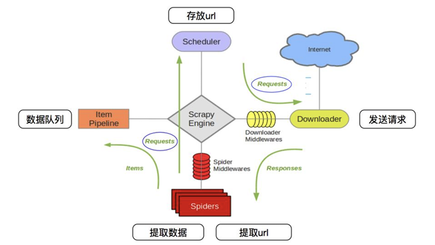

# 爬虫学习笔记

## 前言

## 网络爬虫类型

1. **通用网络爬虫**：即“全网爬虫(Scalable Web Crawler)”,爬行对象从一些种子 URL 扩充到整个 Web，该架构主要为门户站点搜索引擎和大型 Web 服务提供商采集数据。通用网络爬虫的结构大致可以包括页面爬行模块、页面分析模块、链接过滤模块、页面数据库、URL 队列和初始 URL 集合。
2. **聚焦网络爬虫**：聚焦网络爬虫(FocusedCrawler)又称“主题网络爬虫(TopicalCrawler)”，是指选择性地爬行那些与预先定义好的主题相关页面的网络爬虫。和通用网络爬虫相比，聚焦爬虫只需要爬行与主题相关的页面，极大地节省了硬件和网络资源，保存的页面也由于数量少而更新快，还可以很好地满足一些特定人群对特定领域信息的需求。
3. **增量式网络爬虫**：增量式网络爬虫(IncrementalWebcrawler)是指对已下载网页采取增量式更新和只爬行新产生的或者已经发生变化网页的爬虫，它能够在一定程度上保证所爬行的页面是尽可能新的页面。
4. **深层网络爬虫**：深层网络爬虫将 Web 页面按存在方式分为表层网页(Surface Web)和深层网页(Deep Web，也称 Invisible Web Page 或 Hidden Web)。表层网页是指传统搜索引擎可以索引的页面，以超链接可以到达的静态网页为主构成的 Web 页面。深层网页是那些大部分内容不能通过静态链接获取的、隐藏在搜索表单后的、只有用户提交一些关键词才能获得的 Web 页面。

## 网页基础知识

通过理解 HTML 结构、CSS 选择器、JavaScript、HTTP 协议、URL 构成、编码格式等，爬虫开发者能够更好地设计和优化爬虫程序，提高抓取效率和准确性。

### 实现 HTTP 请求

Python 实现 HTTP 请求的常见的 3 种方式:urlib、urllib3 和 requests。

### 解析网页

爬取到一个网页之后，需要对网页数据进行解析，获得我们需要的数据内容 BeautifulSoup 是一个 HTML/XML 的解析器，主要功能是解析和提取 HTML/XML 数据。  
BeautifulSoup 提供一些简单的、Python 式的函数来处理导航、搜索、修改分析树等。Beautifulsoup 通过解析文档为用户提供需要抓取的数据，因为简单，所以不需要多少代码就可以写出一个完整的应用程序。BeautifulSoup 自动将输入文档转换为 Unicode 编码，输出文档转换为 UTF-8 编码。BeautifulSoup3 已经停止开发，目前推荐使用 BeautifulSoup4，不过它已经被移植到 bs4 当中了，所以，在使用 BeautifulSoup4 之前，需要安装 bs4:

## Scrapy 框架

Scrapy 是一套基于 Twisted 的异步处理框架，是纯 Python 实现的爬虫框架，用户只需要
定制开发几个模块就可以轻松地实现一个爬虫，用来抓取网页内容或者各种图片。Scrapy
运行于 Linux/Windows/MacOS 等多种环境，具有速度快、扩展性强、使用简便等特点。即
便是新手，也能迅速学会使用 Scrapy 编写所需要的爬虫程序。Scrapy 可以在本地运行，也
能部署到云端实现真正的生产级数据采集系统。Scrapy 用途广泛，可以用于数据挖掘、监测
和自动化测试。Scrapy 吸引人的地方在于它是一个框架，任何人都可以根据需求对它进行修
改。当然，Scrapy 只是 Python 的一个主流框架，除了 Scrapy 外，还有其他基于 Python 的爬
虫框架，包括 Crawley、Portia、Newspaper、Python-goose、Beautiful Soup、Mechanize、Selenium
和 Cola 等。

