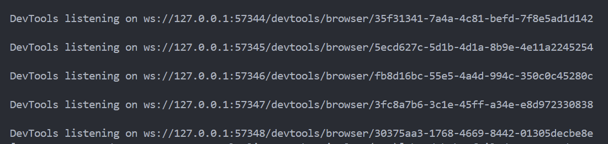
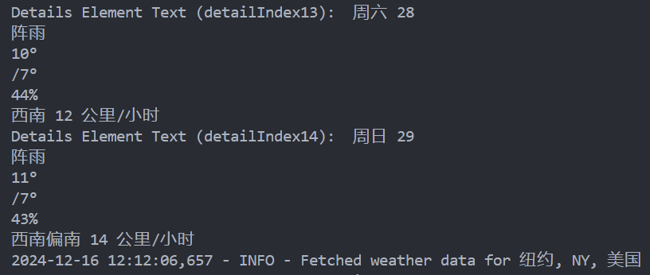
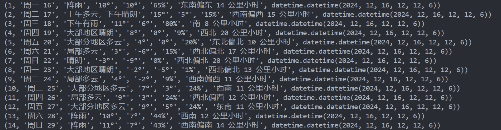

---
hide:
  - navigation
---

# 爬虫爬取天气数据

> 本程序的源代码存放在 [spider-for-weathersite](https://github.com/KevinGuo1007/spider-for-weathersite) 中，所有内容以 [CC BY-SA 4.0 协议](https://creativecommons.org/licenses/by-sa/4.0/)开放。

!!! abstract "概述"

    该爬虫项目用于爬取全球天气信息并将数据存入 MySQL 数据库的完整爬虫程序。它通过多线程技术加速多个省市天气数据的抓取，并利用 Selenium 和 BeautifulSoup 进行网页数据抓取和解析。爬取的天气数据包括日期、天气状况、最高气温、最低气温、湿度和风力等信息。数据被存储到本地 MySQL 数据库中，并且每个省市的数据会被单独创建一张表格。程序使用了线程池、Selenium 模拟浏览器行为和 MySQL 数据库操作来实现目标。

## 技术分析

#### 技术难点：

- 抓取动态网页数据；
- 解决 cookie 问题；
- 多线程爬取提高速率；
- 利用时间戳增量式爬取并按时更新预报天气信息；

### 动态网页爬取方法

1. 使用 selenium 库，通过浏览器模拟操作，获取动态网页内容；
2. 对获取的动态网页内容进行 js 分析，定位到所需的内容数据；
3. 由于该网页的预报信息不是返回的 json 数据，而是通过 js 代码动态生成的，因此需要使用 selenium 模拟浏览器行为，获取动态网页内容；

### 多线程提高爬取速率

- 利用线程池，将任务分配给多个线程，每个线程负责抓取对应`location`的预报天气信息；

### 数据清洗

- `process_weather_data` 函数对抓取到的原始天气数据进行简单的清洗和格式化，去除不必要的字符（例如 `/`），并将数据存储成字典格式，便于后续存入数据库。

### MySQL 数据库

1. 使用 pymysql，将清洗后的数据以--的形式插入数据库的对应 `table` 中；
2. 每次爬取的数据会在数据库中创建一张以省市名称命名的表格，表格结构包括日期、天气状况、气温、湿度和风力等字段；
3. 插入数据时使用了 executemany 方法批量插入，减少数据库的操作次数，提高效率；

## 代码实现思路

#### 1. 配置环境导入 Python 库和依赖包：

```py title="Python" linenums="1"
import pymysql
from datetime import datetime
import requests
from bs4 import BeautifulSoup
import datetime
from selenium import webdriver
from selenium.webdriver.common.by import By
import time
from selenium.webdriver.chrome.service import Service
from webdriver_manager.chrome import ChromeDriverManager
from selenium.webdriver.chrome.options import Options
from selenium.webdriver.support.ui import WebDriverWait
from selenium.webdriver.support import expected_conditions as EC
from selenium.webdriver.common.keys import Keys
from selenium.webdriver.common.action_chains import ActionChains
from concurrent.futures import ThreadPoolExecutor
```

#### 2. 用户输入省市信息：

用户通过命令行输入一组省市名称（例如“北京+北京，广东省+广州市，浙江省杭州市”）。程序将根据这些输入启动相应的爬取任务。

```py title="Python" linenums="18"
def main():
# 获取省份和市区输入
    locations = input("请输入省份和市区（如：北京，广东省广州市，美国洛杉矶）：").split('，')
```

进入 venv 虚拟环境并输入想获取天气地区的名称：  


DevTools 表示当前执行的进程数：  
{ width="640" }

#### 3. 使用线程池并行处理多个爬取任务：

程序利用 ThreadPoolExecutor 创建一个线程池，并为每个省市名称提交一个爬取任务。通过并行化技术加速数据抓取过程。

```py title="Python" linenums="22"
    # 使用线程池进行并行处理
    with ThreadPoolExecutor(max_workers=5) as executor:
        # 为每个城市/省份对提交一个爬取任务
        futures = [executor.submit(spider, location.strip()) for location in locations]

        # 等待所有线程完成任务
        for future in futures:
            future.result()
```

#### 4. 爬取天气数据：

- `spider()` 函数负责启动 Selenium 浏览器，并模拟用户输入省市名称进行搜索，模拟用户点击并正确抵达目标界面，并从页面中提取所需的天气数据
- 获取的数据会通过函数 `process_weather_data` 进行清洗和格式化，然后存储到数据库中。

```py title="Python" linenums="32"
def spider(location):
# 设置自定义的请求头（伪装成正常浏览器）
    chrome_options = Options()
    chrome_options.add_argument('--ignore-certificate-errors')  # 忽略 SSL 错误
    chrome_options.add_argument('--disable-extensions')  # 禁用扩展
    chrome_options.add_argument('--headless')  # 无头模式（可选）
    chrome_options.add_argument('--disable-gpu')  # 禁用 GPU（可选）
    chrome_options.add_argument('user-agent=Mozilla/5.0 (Windows NT 10.0; Win64; x64) AppleWebKit/537.36 (KHTML, like Gecko) Chrome/92.0.4515.159 Safari/537.36')

    # 启动 Chrome 浏览器
    # 使用 Service 来指定 ChromeDriver 路径
    service = Service(r"E:\Code-Libary\Python\CrawlerPro\chromedriver-win64\chromedriver.exe")
    browser = webdriver.Chrome(service=service, options=chrome_options)
    chrome_options.set_capability("pageLoadStrategy", "eager")

    browser.get('https://weather.com/zh-CN/weather/today/l/CHXX0008:1:CH')
    time.sleep(2)

    # 定位 placeholder="搜索城市或邮编" 的 <input> 元素·并将location输入
    input_element = browser.find_element(By.CSS_SELECTOR, 'input[placeholder="搜索城市或邮编"]')
    input_element.send_keys(location)

    try:
        # 等待输入框出现并获取元素
        input_element = WebDriverWait(browser, 5).until(
            EC.element_to_be_clickable((By.CSS_SELECTOR, "input[aria-controls='LocationSearch_listbox']"))
        )

        # 获取输入框的位置和尺寸
        input_location = input_element.location
        input_size = input_element.size

        # 计算点击位置（以输入框的正中间偏下200像素）
        click_x = input_location['x'] + input_size['width'] / 2
        click_y = input_location['y'] + input_size['height'] / 2 + 30  # 向下偏移30像素
        time.sleep(1)
        # 使用 ActionChains 进行鼠标点击
        actions = ActionChains(browser)
        actions.move_to_element_with_offset(input_element, click_x - input_location['x'], click_y - input_location['y'])
        actions.click().perform()
        # 通过 JavaScript 隐藏广告元素
        ad_elements = browser.find_elements(By.CSS_SELECTOR, "div.Card--content--I0ayG")
        for ad in ad_elements:
            browser.execute_script("arguments[0].style.display = 'none';", ad)

    except Exception as e:
        print(f"Error: {e}")

    # 定位 data-from-string="localsuiteNav_3_10 天" 的 <a> 元素并点击
    a_element = browser.find_element(By.CSS_SELECTOR, 'a[data-from-string="localsuiteNav_3_10 天"]')
    a_element.click()

    # 定位在 id="detailIndex0" 的 <details> 元素下的 <svg> 元素
    # <svg set="ui" name="caret-up" class="Icon--icon--ySD-o Disclosure--SummaryIcon--ldYIx DaypartDetails--SummaryIcon--1UVaq" theme data-testid="Icon" viewBox="0 0 24 24">
    svg_element = browser.find_element(By.CSS_SELECTOR, 'details#detailIndex0 svg[name="caret-up"][data-testid="Icon"]')

    # 滚动到目标元素
    browser.execute_script("arguments[0].scrollIntoView(true);", svg_element)
    time.sleep(1)  # 等待滚动完成

    # 查找等待元素并点击
    wait = WebDriverWait(browser, 10)
    svg_element = wait.until(EC.element_to_be_clickable((By.CSS_SELECTOR, 'svg[name="caret-up"][data-testid="Icon"]')))
    svg_element.click()

    # 初始化一个列表，用于存储每个 detailIndex 的天气数据
    weather_data_list = []

    # 从 detailIndex0 到 detailIndex14
    for i in range(15):  # 从 0 到 14
        if i == 0:
            # 定位 id="detailIndex0" 的 <details> 元素下的 <div> 元素，具有 data-testid="DetailsSummary"
            details_element = browser.find_element(By.CSS_SELECTOR, 'details#detailIndex0 div[data-testid="DetailsSummary"]')

            # 打印 id="detailIndex0" 的 <details> 元素的内容
            if details_element:
                print(f"Details Element Text (detailIndex{i}): ", details_element.text)  # 打印匹配元素的文本内容
                weather_data_list.append(details_element.text)  # 将文本内容添加到列表中

        else:
            # 对于 detailIndex1 到 detailIndex14，只定位 <details> 元素
            details_element = browser.find_element(By.CSS_SELECTOR, f'details#detailIndex{i}')

            # 打印匹配的 <details> 元素的文本内容
            if details_element:
                print(f"Details Element Text (detailIndex{i}): ", details_element.text)
                weather_data_list.append(details_element.text)  # 将文本内容添加到列表中

    # 获取当前天气预报的城市名称
    city_name = browser.find_element(By.CSS_SELECTOR, 'span[data-testid="PresentationName"].LocationPageTitle--PresentationName--YxTV7').text

    # 调用 database 函数将所有爬取的天气数据存入数据库
    if weather_data_list:
        print(city_name)
        database(city_name, weather_data_list)
    else:
        print("No weather data was fetched.")
```

执行完爬取数据部分后，对应天气数据最后会输出当前数据的地区信息，终端会输出以下结果：  
{ width="640" }

#### 5. 处理并清洗天气数据：

对抓取到的天气数据进行处理和清洗（如去除多余的符号），并将数据组织成字典格式以便插入数据库。

```py title="Python" linenums="152"
def process_weather_data(weather_data):
    # 按 \n 分割数据
    parts = weather_data.split('\n')

    # 去除  '/' 符号
    for i in range(len(parts)):
        parts[i] = parts[i].replace('/', '')

    # 根据数据的顺序命名
    date = parts[0]
    weather = parts[1]
    maxtemperature = parts[2]
    mintemperature = parts[3]
    humidity = parts[4]
    windy = parts[5]

    # 返回一个字典，包含各个字段
    return {
        'date': date,
        'weather': weather,
        'maxtemperature': maxtemperature,
        'mintemperature': mintemperature,
        'humidity': humidity,
        'windy': windy
    }
```

#### 6. 将数据存入数据库：

```py title="Python" linenums="178"
def database(location, weather_data_list):

    processed_data = [process_weather_data(data) for data in weather_data_list]
    # 输出结果
    for entry in processed_data:
        print(entry)

    # 连接MySQL数据库
    conn = pymysql.connect(
        host='localhost',
        user='root',
        password='***********',
        database='spider_weather_db'
    )
    cursor = conn.cursor()

    # 删除已有的表格
    drop_table_query = f"DROP TABLE IF EXISTS `{location}`;"
    cursor.execute(drop_table_query)

    # 创建表格（表名为用户输入的省份+市区），并添加时间戳字段
    create_table_query = f"""
    CREATE TABLE `{location}` (
        id INT AUTO_INCREMENT PRIMARY KEY,
        date VARCHAR(255),
        weather VARCHAR(255),
        maxtemperature VARCHAR(255),
        mintemperature VARCHAR(255),
        humidity VARCHAR(255),
        windy VARCHAR(255),
        timestamp TIMESTAMP DEFAULT CURRENT_TIMESTAMP  -- 时间戳字段
    )
    """
    cursor.execute(create_table_query)


    # 批量插入数据
    insert_query = f"""
    INSERT INTO `{location}` (date, weather, maxtemperature, mintemperature, humidity, windy)
    VALUES (%s, %s, %s, %s, %s, %s)
    """

    # 使用 executemany 插入批量数据
    cursor.executemany(insert_query, [
        (entry['date'], entry['weather'], entry['maxtemperature'], entry['mintemperature'], entry['humidity'], entry['windy'])
        for entry in processed_data
    ])


    # 提交事务
    conn.commit()

    # 查询并打印整个表单
    cursor.execute(f"SELECT * FROM `{location}`")
    rows = cursor.fetchall()
    for row in rows:
        print(row)

    # 关闭连接
    cursor.close()
    conn.close()
```

存入数据库前会最后输出一次当前地点的天气数据信息：
{ width="640" }

### 程序运行

<video width="960" controls>
<source src="../../../image/spidervedio-01.mp4" type="video/mp4">
Your browser does not support the video tag.
</video>

## 总结

??? question

    选择该网站爬取的主要原因是，当前市面上的天气预报网站大多采用图形化的天气预报形式，且为了适应多平台的使用需求，大多使用动态web框架技术，较难获取其天气数据。
    该天气网站的天气预报数据以文字+表格的形式，相较于先前使用图形化预报，数据容易获取，此外该网站在国内外均可访问，且能查询全球的天气预报。

#### 前景展望

- **可发展的方向**：该程序通过数据库将爬取的数据进行整合，使用者可以非常方便地对不同地方的天气进行查询和爬取，此外可以通过 Python 实现自动化增量式爬取，并通过时间戳设置爬取周期，以实现对实时天气数据的实时更新。该程序的使用者可以零成本使用到能够实时获取全球天气数据。
- **存在的缺陷**：此程序可以进一步优化打包成 API，方便使用者通过 API 接口调用，以实现对天气数据的实时查询，但由于该程序是通过 Selenium 模拟浏览器实时爬取网页，数据爬取速度不是很理想，相较于各天气预报公司提供的原生 API 接口，该程序存在的劣势还是非常明显的。
