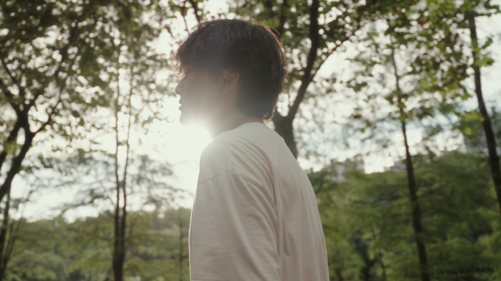
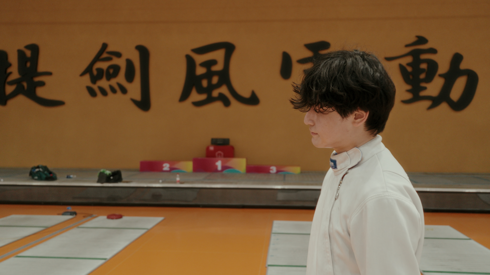
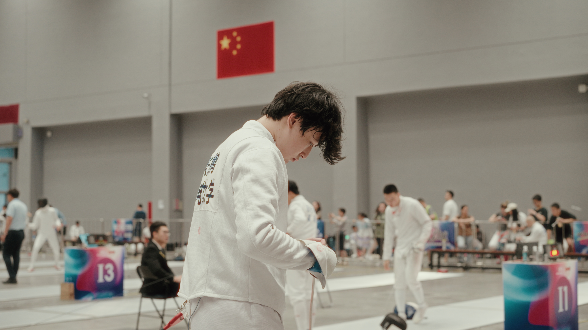
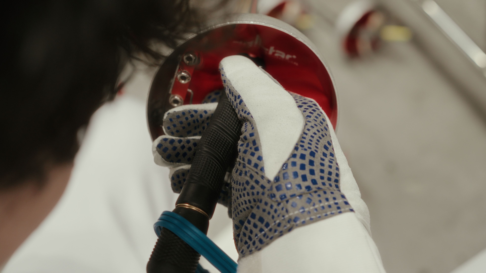
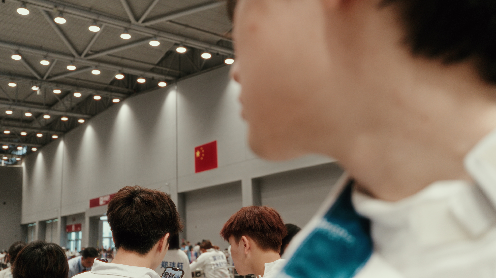

# 提剑风雷动 | 奥运短片 | A7C2 学生作品

## 视频：

> Bilibili ：[提剑风雷动 | 奥运短片 | A7C2 学生作品](https://www.bilibili.com/video/BV1apePeVEZx/?share_source=copy_web&vd_source=fd28b6f3752479b87076d40413144fc3)

## 项目成员：

- 导演：郭越齐
- 击剑运动员：张振鹏

### 简介：

个人第一部声音音效设计作品，视频中的台词语录是出自《肖申克的救赎》电影中，安迪成果逃出后，瑞德内心的感慨。  
视频中表现了主人公比赛前后的紧张心理，以及在备赛训练时的胸怀大志、渴望取得更好成绩的精神状态，通过后期的音效处理使主人公的这些情感更好地融入到视频中，表现给观看视频的观众。

> 有些鸟儿是不能关在笼子里的
> 他们的每一片羽毛都闪耀着自由的光辉
> 当他们飞走的时候
> 你会觉得
> 吧他们关起来是一种罪恶  
> Some birds aren't meant to be caged
> Their feathers are just too bright
> And when they fly away
> The part of you that knows
> it was a sin to lock them up does rejoice
>
> ——《肖申克的救赎》

### 剧照:

> 树林大逆光

> 与标题相呼应

> 每一位运动员都有一个为国争光的梦想

> 回合赛前检查枪柄

> 回头看国旗

---

> 发布日志：  
> 视频于 2024.8.15 发布于 Bilibili
